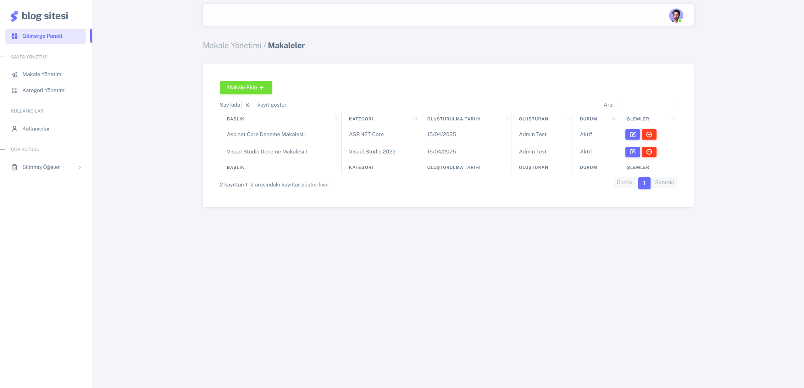

# ASP.NET Core Blog Projesi

[](README.md)
[](README.en.md)

## Proje Hakkında

ASP.NET Core Blog Projesi, modern web teknolojileri kullanılarak geliştirilmiş, çok katmanlı mimari ile tasarlanmış kapsamlı bir blog yönetim sistemidir. Bu proje, yazılım mimarisi prensiplerine uygun olarak geliştirilmiş olup, kullanıcıların blog yazıları oluşturmasına, düzenlemesine ve yönetmesine olanak tanır.

## Proje Mimarisi

**Kullanılan yazılım mimarisi:** Çok Katmanlı Mimari (N-Tier Architecture)

**Projede kullanılan katmanlar:**
- **Entity Layer**: Veritabanı nesneleri ve DTO'ları içerir
- **Core Layer**: Temel araçlar ve arayüzler
- **Data Layer**: Veritabanı işlemleri ve repository deseni
- **Service Layer**: İş mantığı
- **API Layer**: RESTful API hizmetleri
- **Web Layer**: Kullanıcı arayüzü

## Kullanılan Teknolojiler

- **Backend**: ASP.NET Core 8.0, Entity Framework Core 8.0, SQL Server
- **Frontend**: HTML5, CSS3, JavaScript, Bootstrap
- **Mimari Desenler**: Repository Pattern, Unit of Work, DTO
- **Kimlik Doğrulama**: ASP.NET Core Identity, JWT
- **Diğer Araçlar**: AutoMapper, FluentValidation, NToastNotify

## Özellikler

- **Kullanıcı Yönetimi**
  - Rol tabanlı yetkilendirme (Admin, User)
  - Kullanıcı kaydı, girişi ve profil yönetimi
  
- **Makale Yönetimi**
  - Makale oluşturma, düzenleme, silme
  - Kategori bazlı makaleler
  - Resim yükleme
  - Görüntülenme sayısı takibi
  
- **Kategori Yönetimi**
  - Kategori oluşturma, düzenleme, silme
  
- **Yorum Sistemi**
  - Makalelere yorum yapabilme
  - Yorum yönetimi
  
- **Dashboard**
  - İstatistikler ve analizler
  - Yönetim paneli

## Ekran Görüntüleri

### Admin Paneli


### Makale Listesi


### Kategori Yönetimi


### Blog Ana Sayfası


### Makale Detayı


## Kurulum

1. Repository'yi klonlayın
   ```
   git clone https://github.com/yourusername/BlogProject.git
   ```

2. Veritabanını yapılandırın
   - `appsettings.json` dosyasında ConnectionString ayarını yapın
   - Migration'ları çalıştırın
   ```
   dotnet ef database update
   ```

3. Projeyi çalıştırın
   ```
   dotnet run
   ```

4. Tarayıcınızda şu adresi açın
   ```
   https://localhost:7145
   ```

5. Varsayılan kullanıcılar
   - Superadmin: superadmin@gmail.com / 123456
   - Admin: admin@gmail.com / 123456

## Proje Yapısı

```
BlogProject/
├── BlogProject.Api/           # API katmanı
├── BlogProject.Core/          # Çekirdek altyapı
├── BlogProject.Data/          # Veri erişim katmanı
├── BlogProject.Entity/        # Entity ve DTO'lar
├── BlogProject.Service/       # Servis katmanı
└── BlogProject.Web/           # Web uygulaması
```


## İletişim

GitHub: (https://github.com/evrengalip)  
LinkedIn: (https://www.linkedin.com/in/evrengalip/)
