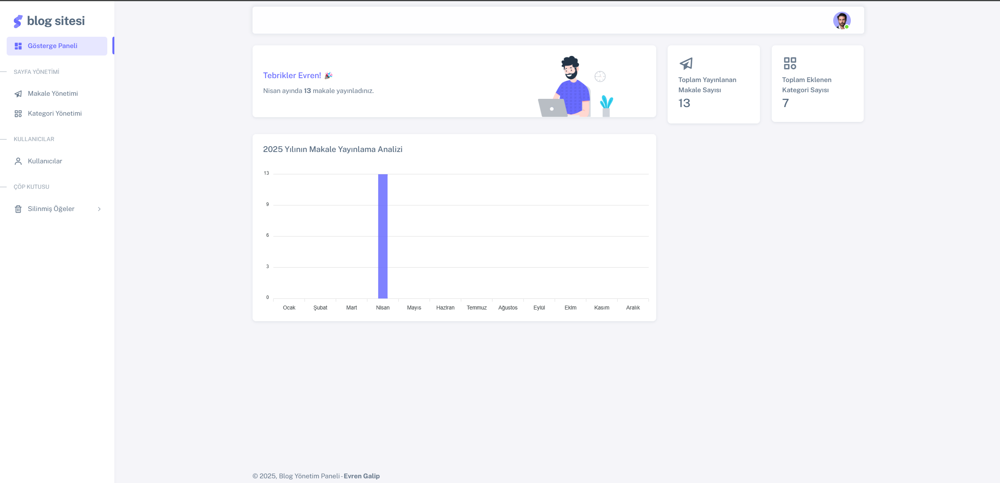
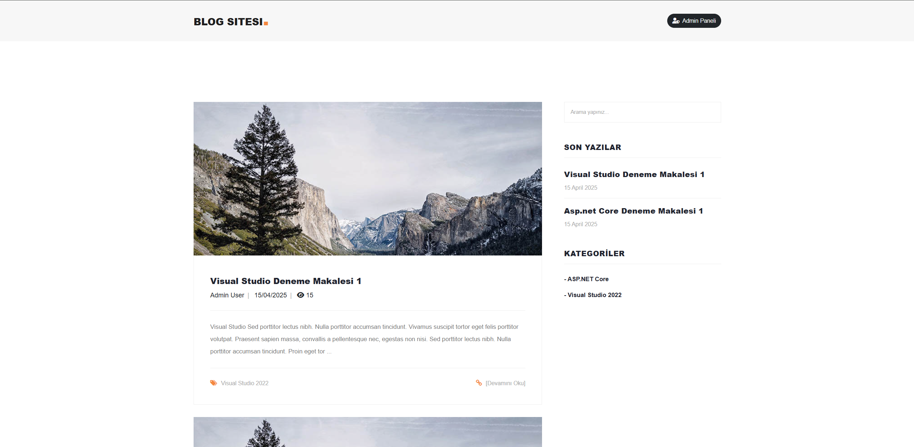
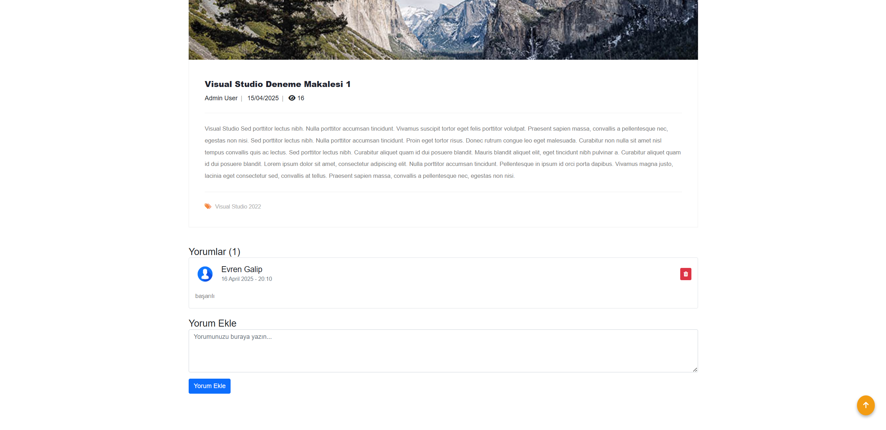
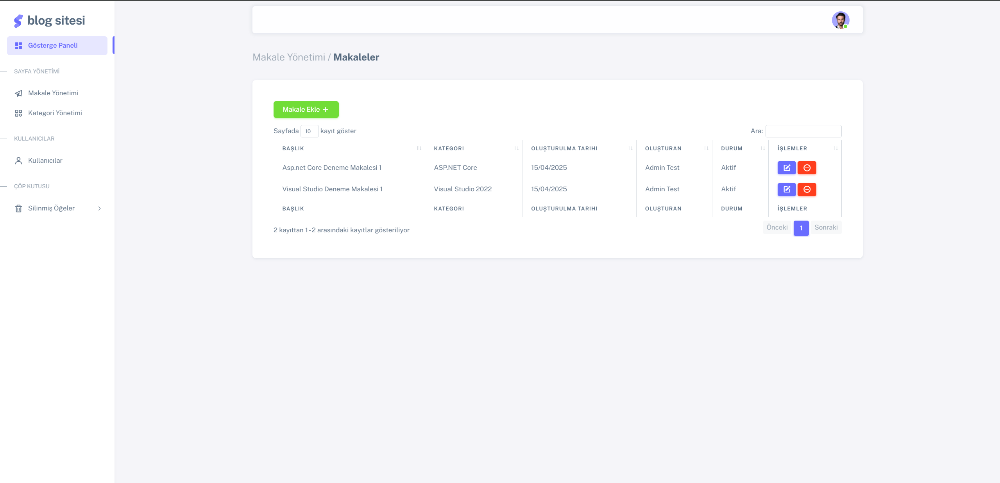
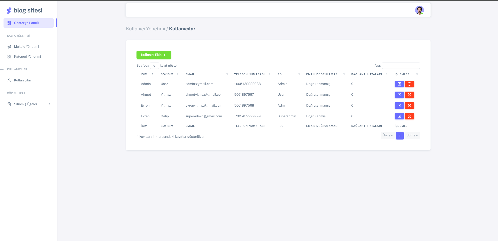

# ASP.NET Core Blog Projesi

## Proje Hakkında

Bu proje, ASP.NET Core MVC ve Entity Framework Core kullanılarak geliştirilmiş kapsamlı bir blog yönetim sistemidir. Kullanıcıların kayıt olabildiği, giriş yapabildiği, blog yazıları oluşturabildiği ve yönebildiği bir web uygulamasıdır. Proje, SOLID prensipleri ve Repository Pattern kullanılarak geliştirilmiştir.

## Teknoloji Stack'i

- **Backend**: ASP.NET Core 8.0
- **ORM**: Entity Framework Core 8.0
- **Veritabanı**: MS SQL Server
- **Frontend**: HTML, CSS, JavaScript, Bootstrap
- **Kimlik Doğrulama**: ASP.NET Core Identity
- **Pattern**: Repository Pattern, Unit of Work
- **Diğer**: AutoMapper, FluentValidation

## Proje Yapısı

N-Katmanlı mimariyle geliştirilmiş olup, aşağıdaki katmanlardan oluşmaktadır:

```
BlogProject/
├── BlogProject.Core/          # Temel arayüzler ve varlıklar
├── BlogProject.Entity/        # Veritabanı modelleri ve DTO'lar
├── BlogProject.Data/          # Veritabanı işlemleri ve repository implementasyonları
├── BlogProject.Service/       # İş mantığı servisleri
├── BlogProject.Web/           # Web uygulaması (MVC)
└── BlogProject.Api/           # RESTful API
```

## Özellikler

### Kullanıcı Yönetimi
- Kullanıcı kayıt, giriş ve çıkış işlemleri
- Rol tabanlı yetkilendirme (Superadmin, Admin, User)
- Kullanıcı profil yönetimi

### Blog Yönetimi
- Makale ekleme, düzenleme, silme işlemleri
- Kategorilere göre makalelerin listelenmesi
- Makalelere resim yükleme desteği
- Makale görüntülenme sayısı takibi

### Kategori Yönetimi
- Kategori ekleme, düzenleme, silme işlemleri
- Kategorilere göre makalelerin filtrelenmesi

### Yorum Sistemi
- Makalelere yorum yapabilme
- Yorum silme işlemleri
- Yorumların yönetimi

### Dashboard Özellikleri
- Makale istatistikleri
- Kategori istatistikleri
- Aylık makale yayınlama grafiği

## Ekran Görüntüleri

### Admin Paneli


### Blog Ana Sayfası


### Makale Detay Sayfası


### Kategori Yönetimi


### Kullanıcı Yönetimi


## Kurulum

1. Repository'yi klonlayın:
```bash
git clone https://github.com/yourusername/BlogProject.git
```

2. Veritabanı bağlantısını yapılandırın:
   - `appsettings.json` dosyasında ConnectionString'i düzenleyin
   - Migration'ları çalıştırın:
```bash
dotnet ef database update
```

3. Projeyi çalıştırın:
```bash
dotnet run
```

4. Tarayıcınızda aşağıdaki adresi açın:
```
https://localhost:7145
```

## Varsayılan Kullanıcılar

Sisteme giriş yapmak için şu hazır kullanıcıları kullanabilirsiniz:

- **Superadmin**:
  - Email: superadmin@gmail.com
  - Şifre: 123456

- **Admin**:
  - Email: admin@gmail.com
  - Şifre: 123456

## Proje Gereksinimleri ve Gerçekleştirilen Özellikler

1. ✅ **Kullanıcı Yönetimi (Authentication & Authorization)**
   - Kullanıcılar sisteme kayıt olabilir, giriş yapabilir ve çıkış yapabilir
   - Sadece giriş yapan kullanıcılar yeni blog yazısı ekleyebilir, düzenleyebilir ve silebilir
   - Misafir kullanıcılar sadece blog yazılarını okuyabilir

2. ✅ **Blog Yönetimi**
   - Blog yazıları için CRUD (Create, Read, Update, Delete) işlemleri
   - Blog yazılarında tüm gerekli alanlar mevcut: Başlık, İçerik, Yazar bilgisi, Yayınlanma Tarihi, Kategori, Görsel

3. ✅ **Veri Tabanı Yapısı**
   - Entity Framework Core kullanıldı
   - Migrations ile veri tabanı oluşturuldu
   - İlişkiler kuruldu: Kullanıcı-Blog Yazısı (One to Many), Blog Yazısı-Kategori (Many to One)
   - Örnek test verileri eklendi

4. ✅ **Sayfa Yapısı ve Tasarım**
   - Razor Syntax kullanıldı
   - Bootstrap ile responsive tasarım yapıldı
   - Layout, Partial Views ve Sections kullanıldı
   - Blog detay sayfası oluşturuldu
   - Blog yazıları anasayfada listeleniyor ve kategori filtresi mevcut

5. ✅ **Form İşlemleri ve Validations**
   - Model Validations uygulandı
   - FluentValidation ile kapsamlı doğrulamalar eklendi
   - Hatalar kullanıcıya gösteriliyor

6. ✅ **Bonus Özellikler**
   - Kullanıcılar yazılara yorum yapabiliyor
   - Yorumlar sadece giriş yapmış kullanıcılar tarafından yapılabiliyor
   - Blog yazıları için görsel yükleme özelliği eklendi
   - Dashboard paneli ile istatistikler sunuldu
   - RESTful API desteği eklendi
   - Çoklu dil desteği için altyapı hazırlandı


## İletişim

GitHub: (https://github.com/evrengalip)
Email: evrengalip327@gmail.com
